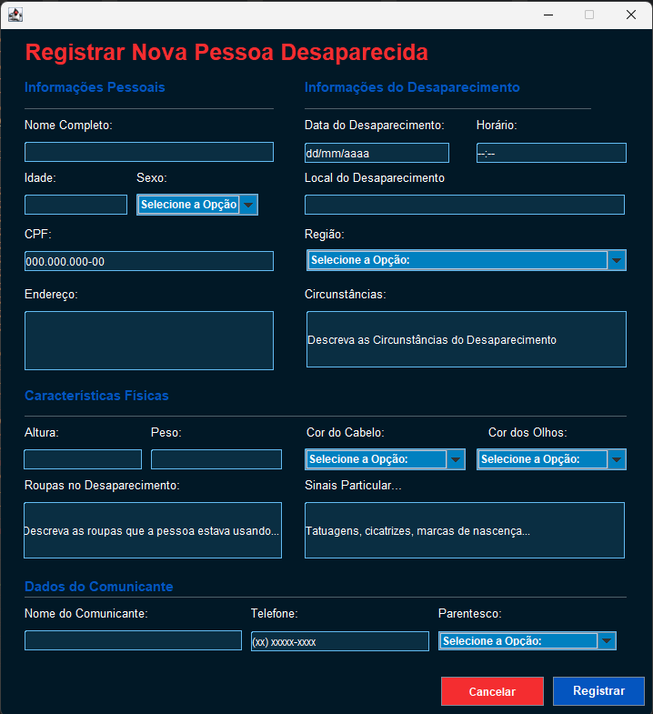
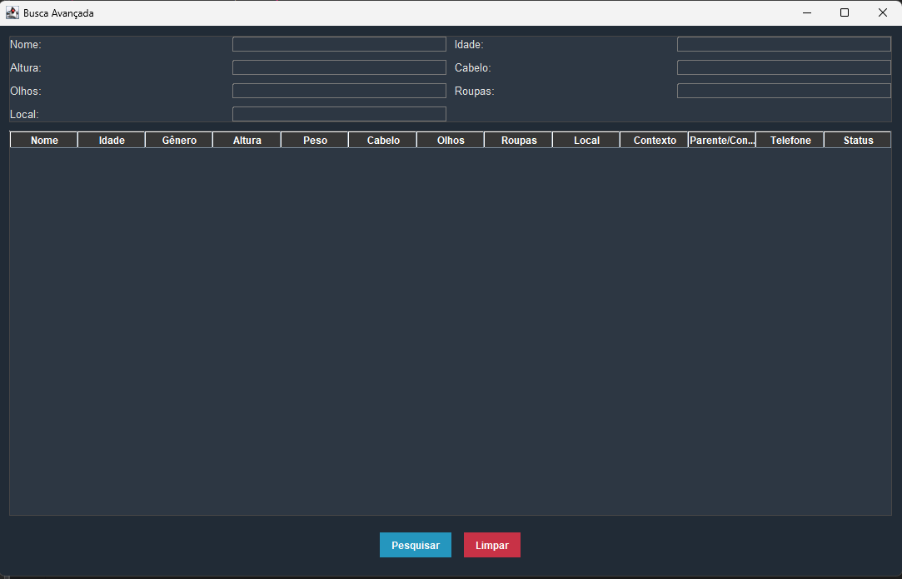
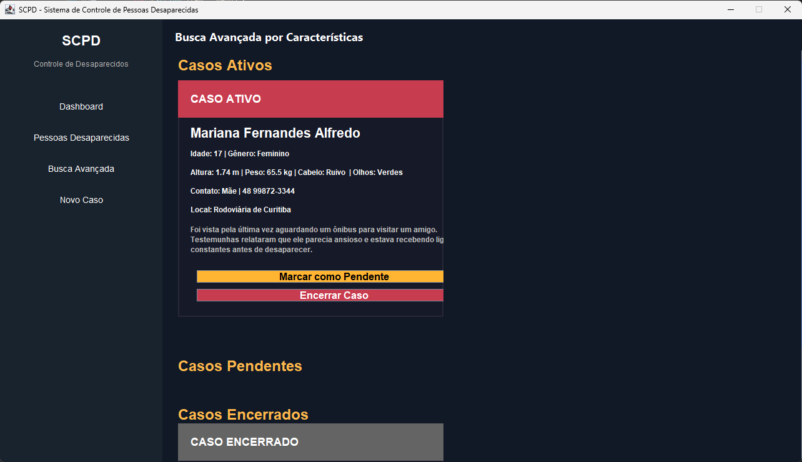

# 🕵️‍♀️ Sistema de Controle de Pessoas Desaparecidas

Este projeto foi desenvolvido como uma **Atividade Prática Supervisionada (APS)** da faculdade de Ciênncia da Computação.  
A proposta foi criar um sistema funcional e acessível, utilizando **Java e Swing**, para organizar e acompanhar informações de pessoas desaparecidas.  

A ideia central foi construir uma ferramenta que pudesse ser utilizada por **órgãos de segurança pública**, como delegacias e setores de investigação, oferecendo uma forma rápida e intuitiva de registrar, consultar e visualizar dados importantes durante o andamento dos casos.

A aplicação conta com quatro telas desenvolvidas em Swing e segue uma arquitetura dividida em **camadas (Model, DAO, View)**, colocando em prática conceitos fundamentais como:
- Programação orientada a objetos  
- Integração com banco de dados através de JDBC  
- Construção de interfaces gráficas 

---

## 📌 Funcionalidades Principais
- **Cadastro de pessoas desaparecidas**  
- **Busca avançada** com vários filtros    
- **Controle de status** (andamento, pendente, encerrado)  
- **Listagem** com organização simples e visual  
- **Interfaces gráficas**, pensadas para facilitar o uso  

---

## 🖼️ Telas do Sistema

Para facilitar a visualização do funcionamento da aplicação, aqui estão as quatro telas principais do sistema de controle de pessoas desaparecidas.

---

### 📌 1. Dashboard (Tela Inicial)

  

---

### 📝 2. Tela de Cadastro

  

---

### 🔍 3. Tela de Busca e Filtros

  

---

### ✏️ 4. Tela de Atualização de Dados

  

## 🛠 Tecnologias Utilizadas
- **Java**  
- **Swing (javax.swing)**  
- **JDBC**  
- **Padrão DAO**  
- **Arquitetura MVC simplificada**
- **Banco de Dados MySQL**
- **BR Modelo**
- **Trello**

---

## 📁 Conteúdo do Repositório
- **Código-fonte completo**  
- **Model** – classes de representação dos dados  
- **DAO** – comunicação com o banco  
- **Views** – telas criadas em Swing
- **MySQL** - banco de dados usado
- **Slides da apresentação da APS**  
- **Documento acadêmico** - com fundamentação teórica do projeto 

---

## ▶️ Execução

Para rodar o sistema:

1. Importe o projeto em uma IDE como **IntelliJ**, **Eclipse** ou **NetBeans**  
2. Configure o driver JDBC  
3. Execute a classe **Dashboard.java**, que abre o painel principal  

A partir daí, todas as telas estarão acessíveis para navegação, cadastro, busca e edição.

---

## 📝 Objetivo Acadêmico e Social

Além do propósito acadêmico, este sistema representa uma simulação de um software que poderia apoiar **delegacias e setores responsáveis por investigações de desaparecimento**.

A ferramenta foi pensada para oferecer:
- Organização clara dos registros  
- Acesso rápido às informações  
- Atualização simples do status dos casos  
- Um fluxo intuitivo para operadores e agentes públicos  

---

## 👩‍💻 Desenvolvido por

**Manuella de Fátima Kuiawa** – responsável pelo desenvolvimento do sistema, criação das telas e implementação do código.  
**Evelyn de Souza** – responsável pela produção, organização e estruturação do documento acadêmico que acompanha o projeto e criação do modelo lógico e conceitual do banco de dados.
